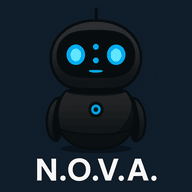

# iamai-pal
AI personal assistant application



# N.O.V.A. – Next-gen Optimized Virtual Assistant

**N.O.V.A. (Next-gen Optimized Virtual Assistant)** is an AI-powered personal assistant desktop application built using **Unreal Engine 5** and **C++**, designed to be accessible, useful, and engaging for users of all ages. The assistant features a 3D animated robot companion with both voice and text interaction, integrating cutting-edge AI models for smart responses.

## ✨ Features

- 🎙️ Push-to-talk voice interaction with optional keyboard toggle
- 🔄 Switchable modes between text input and voice commands
- 🔊 Text-to-speech output using Unreal Engine TTS plugin
- 🧠 AI assistant powered by large language models
- 🤖 3D animated buddy character (Blender + UE5)
- 🕹️ Starts in a corner (512x512) with option for fullscreen
- 🌅 Dynamic background sky using real-time clock (day/night via Goodsky)
- 🔄 Loading screen with animated robot intro sequence
- 🎛️ User volume and mute controls integrated with PC settings

## 🛠️ Technologies Used

- **Unreal Engine 5.4+** (C++ and Blueprint)
- **Visual Studio 2022**
- **Blender** (for character modeling and animation)
- **Goodsky plugin** – Dynamic sky background
- **Unreal Text-to-Speech Plugin**
- **OpenAI ChatGPT API** (optional backend integration)

## 🚀 Getting Started

1. Clone this repo:
   ```bash
   git clone https://github.com/iamai-core/iamai-pal.git
   ```
2. Open the `.uproject` file in **Unreal Engine 5.4+**
3. Compile using **Visual Studio 2022**
4. Press **Play** to test N.O.V.A. in editor

## 📦 Planned Features (Roadmap)

- ✅ Basic push-to-talk voice and text input
- ✅ Text-to-speech response
- ✅ Animated loading robot
- 🔜 Memory and personalization
- 🔜 Integration with calendar, weather, and notes
- 🔜 Fullscreen assistant mode with gesture controls
- 🔜 GPT-4 API or local LLM integration (user toggle)

## 👥 Contributors

- **Trevor Hicks** – UI Design & Implementation
- **Collin Greiss** – Plugin Integration and 3D Environment Setup
- **Kolten Morales** – Blender Model & Animations, UI Collaboration
- **Kylie Rhodus** – Cross-Platform OS Support (Mac & Linux)
- **Team iamai-core**

## 🌐 Links

- 🔗 [iamai-core on GitHub](https://github.com/iamai-core)

## 📄 License

MIT License. See `LICENSE.md` for details.
